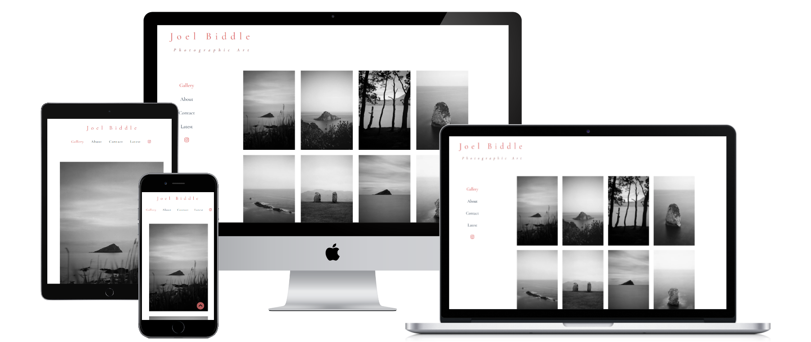
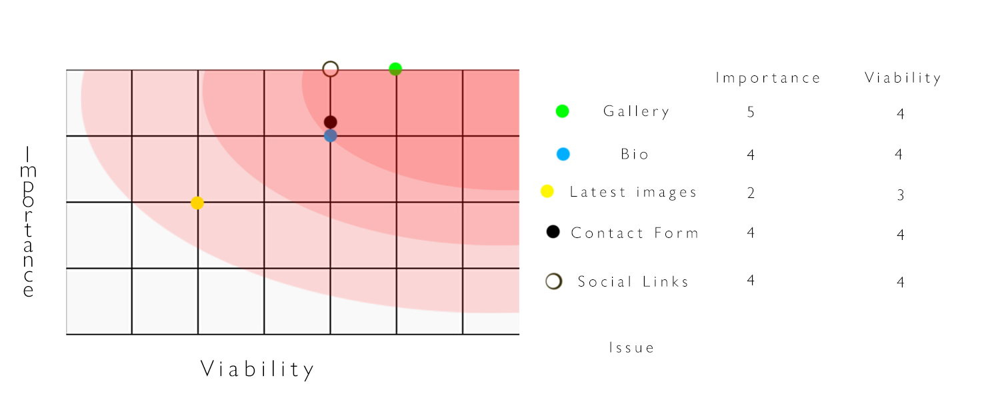
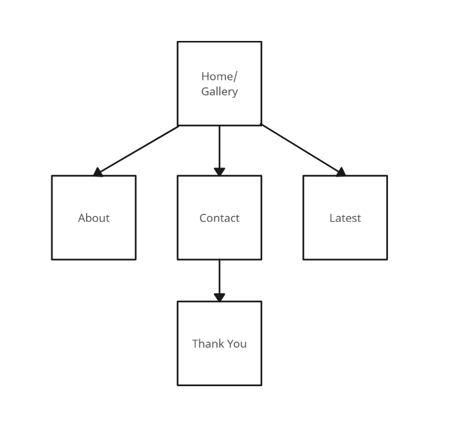
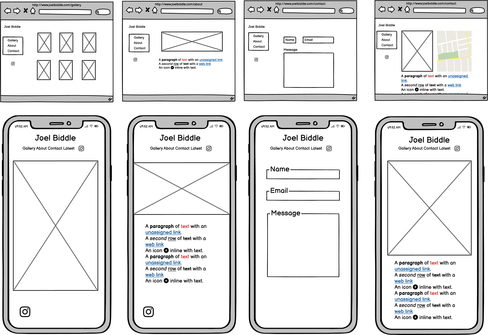
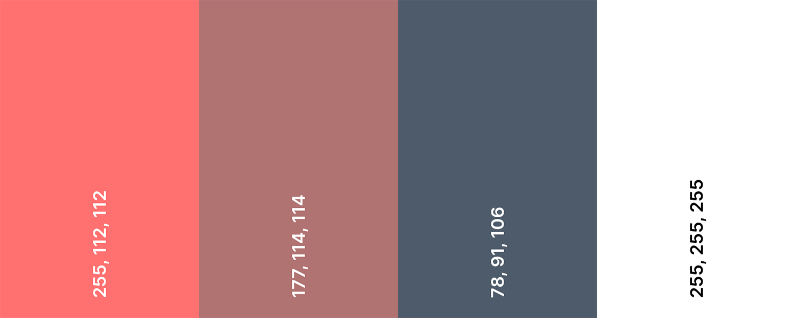

# Photography Portfolio Site

[View Live Project](https://jpbiddle.github.io/Joel-Biddle/index.html)

## Table of Contents

- [Photography Portfolio Site](#photography-portfolio-site)
  - [Table of Contents](#table-of-contents)
  - [Introduction](#introduction)
  - [UX](#ux)
    - [Demographics](#demographics)
    - [User Stories](#user-stories)
      - [Current User](#current-user)
      - [New User](#new-user)
      - [People looking for photos](#people-looking-for-photos)
    - [Development Planes](#development-planes)
    - [Strategy](#strategy)
    - [Scope](#scope)
    - [Structure](#structure)
    - [Skeleton](#skeleton)
    - [Surface](#surface)
      - [Colour Scheme](#colour-scheme)
      - [Typography](#typography)
      - [Imagery](#imagery)
  - [Features](#features)
    - [Home page](#home-page)
    - [About](#about)
    - [Contact](#contact)
    - [Latest](#latest)
    - [Future features](#future-features)
  - [Issues and Bugs](#issues-and-bugs)
    - [Lightbox bug](#lightbox-bug)
    - [Gallery misalignment](#gallery-misalignment)
    - [Latest image page map](#latest-image-page-map)
    - [Gallery hover in mobile](#gallery-hover-in-mobile)
    - [Side navigation not lining up](#side-navigation-not-lining-up)
  - [Technologies Used](#technologies-used)
    - [Main Languages Used](#main-languages-used)
    - [Frameworks, Libraries and Programs](#frameworks-libraries-and-programs)
  - [Testing](#testing)
  - [Deployment](#deployment)
    - [Deploying](#deploying)
  - [Credits](#credits)
    - [Code](#code)
  - [Acknowledgements](#acknowledgements)

## Introduction

This portfolio website was designed as a waypoint between social media and as a platform to view photography in more depth, whilst also providing methods of contacting the site owner, myself. Additional information such as a bio and a timeline of exhibitions will also be included.

This website was created as the first of four milestone projects as part of my Web Development Diploma at Code Institure.

The primary requirements are that the website be responsive, static and uses HTML and CSS. The site must be at least 3 Pages.

***

## UX

### Demographics

Users for this website will be as follows;

- Existing social media followers
- Users who are new
- People looking to enjoy beautiful photographs

### User Stories

#### Current User

1. Current followers must be able to find new bio information and previous exhibition timelines easily.
2. Current followers must be able to easily navigate to a place to send a direct email message.
3. Content must be navigated in a small number of steps.

#### New User

1. New users must intuitively navigate the site.
2. New users must be able to find relevant information easily.
3. The site must be attractive enough to encourage return visits in future.

#### People looking for photos

1. These users must be able to navigate through the gallery easily.
2. Links to contact and social media must be accessible easily.

***

### Development Planes

To create a website that covers all of the answers to the user stories and is as functional as possible, the developer has to cover the main user needs, which includes access to a bio and exhibition list, a gallery, contact page and latest image page.

***

### Strategy

The strategy was broken down by focussing on the essential elements of a portfolio website, as well as the different types of users that would access these elements.

- #### Roles

  - Current followers
  - New users
  - Photography enthusiasts

- #### Demographic

  - All ages but typically adult
  - Residing in UK or USA
  - Keen interest in photography
  - Enjoys minimalist aesthetic
  
- #### Psychographic

  - Lifestyles:
    - Interest in photography
    - Potentially a photographer
    - Interest in the arts
  - Personality & Attitudes
    - Creative
    - Liberal
  
- #### Values

  - Interest in local community and local artists
  - Interest in the individual as opposed to corporation/business

The website needs to enable the user to:

- View content in an enjoyable way
- Find social media links
- Read about the artist
- Contact the artist
- View updates to content to feel current and connected to the content

The website needs to enable the site manager to:

- Recieve messages from users
- Update content when neccessary

with this in mind I have produced a short diagram representing the relationship between the importance versu viability of elements of the site.

Viability chart

***

### Scope

Defining the requirements based on the strategy plane, two categories have been identified. These will be content and function requirements.

- Content Requirements
  - A gallery of at least 10-12 images, as standard with portfolios. More is better.
  - A biography (short).
  - Latest image content
  - Latest image description

- Function Requirements
  - An interactive gallery with the ability to enlarge
  - A contact form
  - Links to instagram
  - Ease of navigation between all pages.

***

### Structure

Based on the above information the site was then organised into a structure to enable an efficient navigation.

As you will see below the hierarchy is as simple as it possible.

Hierarchy

***

### Skeleton

Wireframes were produced using balsamiq. These are to showcase the site pages with the user experience in mind.

Wireframes

***

### Surface

#### Colour Scheme

The colour scheme chosen was minimal to reflect the stlye of the photography presented within the website.

The colour palette began with a plain white background. The photographs which make up the bulk of the website content are all black and white and therefore a white background is very appropriate to avoid becoming a distraction.

Text and headers are charcoal, rgb(78, 81, 106) as to fit with the minimal theme. When a navigation button is selected it becomes a salmon pink colour - rgb(255, 112, 112). This was to make it obvious which page was selected as initially the navigation buttons adopted a heavier font weight but when thewebsite was run through lighthouse there were accessability issues and it needed to be clearer.

The website header and back to top button was also the salmon pink and the subheader was a less saturated version of this colour -rgb(177, 114, 114) to allow the main header to be more attention grabbing.

This less saturated colour was also used as the colour to represent when a mouse hovers over a navigation.

Colour Palette

#### Typography

The typography chosen was sourced from Google Fonts.

My chosen font was 'Cormorant Garamond' with Serif as a backup.

A combination of font weights were deployed as well as a sparing use of italic font for the sub header and the selected exhibition header when in mobile mode.

#### Imagery

All imagery is original content from my own archive, including the favicon which was produced using an image featuring in the index gallery.

***

## Features

The website features a consistent set of navigation and a header.

- The header is not static as it felt like it took took much real estate when it was tested.
- The navigation is static as some of the pages became ouite long with content and therefore it was neccessary, however it is not static for mobile users.
- Where pages are long enough, a back to top button is available to mobile users.

***

### Home page

The home page serves as the gallery as well as the landing page. It presents the most valuable content right away. It is simple and follows the B2C principle of presenting the 'product' up front and not overwhelming the audience with text and options.

The gallery is interactive for desktop users - hover your mouse over a thumbnail and it will enlarge to indicate where your mouse is.

There is also a lightbox function to allow users to view the gallery in a carousel.  

On smaller screens the navigation is moved to the top and the gallery becomes a column of single images for the viewer to scroll through.

***

### About

Here we are presented with a header image and a short biography. This is intended as a longer form bio than would be available on social media.

Following that there is a timeline displaying an exhibition timeline.

On smaller screens the heading image moves to spead accross the full width, the text sits below and the timeline reduces in size.

***

### Contact

Keeping in theme witht he rest of the website, the contact page is minimal and functional.

The user is presented with an input for name, email address and a message. Name and email are required.

On smaller screens the contact for adjusts to fit while the navigation on the left is hidden in favour of the navigation to the top.

When the contact form is submitted you are directed to a page which deplays 'Thank you for your message!'.

***

### Latest

The final page is a display of the artists latest work with a short description and a google map to show where the photograph was taken.

As an extension to social media, this offers visual information and a more detailed description than would usually be found. 

The google map is hidden for mobile users to encourage a faster loading time and to reduce clutter on a smaller screen.

***

### Future features

Due to time restraints I was unable to make use of the following features:

- Print store
- Pop up description for each image
- Pop up description for each exhibition

***

## Issues and Bugs

### Lightbox bug

When deploying lightbox I had a lot of trouble getting it to work. I had used allof the correct attributes and had later learned that the line of script for lightbox was supposed to be at the bottom of the page to load in the right order. After placing it there and it still not working I asked my tutor, Jason, who saw that the bootstrap code that was needed for the lightbox to work was below the lightbox code.
After moving it above, Lightbox was able to use that bootstrap script and work in order.

### Gallery misalignment

My gallery was not centering itself properly with smaller screen sizes. Later I found that the padding on the mobile navigation was causing the misalignment and when removed the gallery was positioned correctly.

### Latest image page map

When first integrating the Google map into the latest page I found it quite difficult to work with. It didn't behave asI was expecting and it caused a lot of frustration. The solution was removing all of the styling that came with the embedded map and applying custom styling. I also found that the map was constructed from divs, iframes and anchors and changing the styling of each of these had a big impact so care was needed there.

### Gallery hover in mobile

I was finding it difficult to navigate through my website on mobile mode because of the hover function I had placed on my gallery. When at the bottom of the page, sometimes the image would enlarge and make it difficult to press the back to top button. The simplest solution was to remove the hover/enlarge feature on mobile mode as you don't have a mouse to use to hover regargless.

### Side navigation not lining up 
I wanted the fixed navigation to be in the same place accross all pages. I found that on the gallery page it was pushed to the right. After much testing I noticed that I had accidentally nested it inside the incorrect div and that was the cause of the issue.

[Back to top](#photography-portfolio-site)

***

## Technologies Used

### Main Languages Used

- HTML5
  - Bootstrap 5 & lightbox
- CSS

### Frameworks, Libraries and Programs

- Google Fonts
  - GoogleFonts was used to import the Cormorant Garamond and Serif fonts which were used in this project. 
- Font Awesome
  - Font Awesome was used to import the Instragram icon for the navigation and the back to top chevron.
- CodeAnywhere
  - CodeAnywhere was used for writing code, commiting and pushing to GitHub.
- GitHub
  - GitHub was used to store the project.
- Balsamiq
  - Balsamiq was used to create wireframes at the beginning of the project.
- Coolors
  - Coolors was used to create a simple colour palette for the website.
- FreeFormatter
  - FreeFormatter was used to beautify my HTML and CSS code and ensure it was optimal for reading.
- W3C Validator
  - W3C Validator was used at the end of the project to check forany errors written in my code for both HTML and CSS.
- w3Schools
  - Here I learned how to create a back to top button as well as how to deploy bootstrap.
- CodePen 
  - Here I earned how to greate a timeline and how to create a responsive gallery.
- Google maps
  - Here I was able to obtain to code to place a google map into my latest image page.

***

## Testing

Please view full testing document [here](README.md)

***

## Deployment

This project was developed using CodeAnywhere and was then committed to GitHub using the GitPod terminal.

### Deploying

***

To deploy this page to GitHub Pages from its GitHub repository, the following steps were taken:

- Log into GitHub or create an account.
- Find the GitHub Repository.
- At the top of the repository, select Settings from the menu.
- At the bottom of the Settings page find the "Pages" section -located on the left hand navigation.
- Under "Source" click the drop-down menu labelled "None" and select "Main".
- Upon selection, the page will automatically refresh meaning that the website is now deployed.
- Scroll back down to the "Pages" section to find the deployed link.

## Credits

***

### Code

- CodePen
  - User @hassan-kamal - Pure CSS responsive timeline - I found his work on CodePen and it was vauable for creating my exhibition timeline element on the about.html page. [Link](https://codepen.io/hassan-kamal/details/NNvYEQ)
  - User @atelierbram - Image thumbnail hover - I learned a simple was to make a thumbnail enlarge when your mouse hovers on it by looking at this users code. [Link](https://codepen.io/atelierbram/pen/XKYxge)
- W3schools
  - I used W3schools to learn how to create a back to top button using only HTML and CSS. [Link](https://www.w3schools.com/howto/howto_js_scroll_to_top.asp)
  - I also used W3Schools to help with deploying Bootstrap and Lightboxes.
- GitHub
  - Here I was guided on how to implement lightboxes. [Link](https://trvswgnr.github.io/bs5-lightbox/#:~:text=Lightbox%20for%20Bootstrap%205%20will,lightbox%22%20to%20your%20anchor%20tags.&text=import%20Lightbox%20from%20'bs5%2Dlightbox,%2Dlightbox%2Dtoggle')
- Google map
  - I was able to source the code for a google map here.[Link](https://www.embed-map.com/)

## Acknowledgements

***

- I would like to thank my family and friends for helping with texting and developing the user experience.
- I Would like to thanki my mentor, Seun, for their guidance and experience, and my tutor, Jason, for helping me with any difficulties with bugs.
- I'd also like to thank the Code Institute Slack community who are always available for help.

[Back to top](#photography-portfolio-site)

***