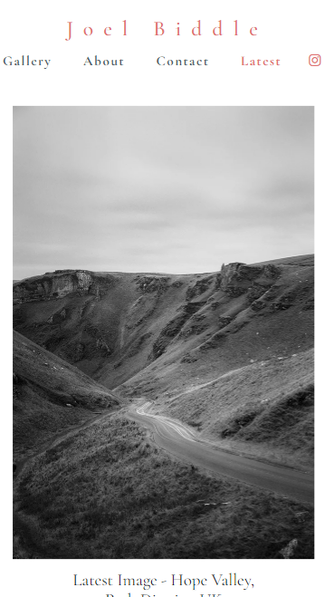

# Photography Portfolio Testing

[Main README.md file](https://github.com/JPBiddle/Joel-Biddle/blob/main/README.md)

[View Live Project](https://jpbiddle.github.io/Joel-Biddle/index.html)

# Contents

1. [Testing User Stories](#testing-user-stories)
2. [Manual Testing](#manual-testing)
3. [Automated Testing](#automated-testing)
4. [Further Testing](#further-testing)

***

## Testing User Stories

### First time visitor

- As a first time visitor, I want to be able to view the gallery with ease and navigate through pages.
  - The navigation is in the intuitive location and a gallery is presented on the landing page.
  - The site title and the 'galley' navigation both return users to the landing page.
  - Links bring you to expected pages as described.

- First time visitors want to understand the visual aesthetic quickly so they will want to explore the site.
  - The presentation of an immediate gallery has this effect and content is available on all pages with the exception of the contact page.

- As a first time visitor I want to know more about the photographer and where I can get more content.
  - The about page is there to give additional information in an easily consumed amount so as not to be overwhelming with text.
  - The link to instagram is clearly displayed on every page of the site.
  
- As a first time visitor I want to be able to feel connected to the site.
  - The latest image page allows a sense of connection by showing the viewer something new and fresh, assuring them that this is a site of new and up to date content.

### Returning Visitor

- As a returning visitor, I want to see the latest content available.
  - The latest image page fulfils this need.

- As a returning visitor, I want to be able to contact the site owner
  - The contact page is the ideal way to contact the site owner.
  - Links to Instagram are an alternatvie method of communication.

***

## Manual Testing

To check the responsiveness of the website accoss all devices, each page was tested using the developers tools regularly.
When changing to mobile mode, features that change are checked.,for example the mobile navigation must disappear in desktop mode, and the Google map on the latest image page must disappear on mobile mode.
Below are screenshots from various pages - one showing desktop, one for tablet display and one for mobile. 
Although only three screenshots are show, every page was tested at every size.
All links were checked, including the instagram external link.

Index Desktop Size

About Tablet Size

Latest Phone Size

The gallery was tested on desktop to ensure it worked properly, though this feature is disabled on mobile. Here every image was checked through the whole gallery.

Gallery

Commonly used elements such as the back to top button were tested on every page, as well as all sizes. This was also the case for elements that change when hovered.
Below are a few screenshots showing the testing of hover links and the back to top button.

Hover Gallery

Back to Top

Hover Navigation

Functionality of the contact form was tested to enure it asked for required fields and when submitted a thank you message was displayed.

Required Field

Thank You Message

On the latest image page the Google map was tested for functionality and to ensure it disappeared on mobile mode.
The map itself was checked using the buttons on it, and developer tools were used to check for sizing changes.

Google Map

***

## Automated Testing

### Code Validation

I used the W3C markup validator to check that there were no syntax errors in my HTML or CSS. Any that were found were corrected until the result was as shown below - no errors.

W3C Validator

### Lighthouse

Part of my testing was using Lighthouse from Chrome to check accessibility, SEO performance and general loading performance.
After my first test I decided to reduce the size of all images by saving them as WEBP instead of JPG to improve load times.
I also added an alt to the about header that I had missed. 
Below is a screenshot of the current Lighthouse results.

Lighthouse Results

***

## Further Testing

The website was viewed on a variety of devices. 
This includes Windows desktop and latop, iphone 8 and 15, ipad pro and Google pixel phone.
Friends and family were asked to test and report any issues they had.

[Back to top](#photography-portfolio-testing)